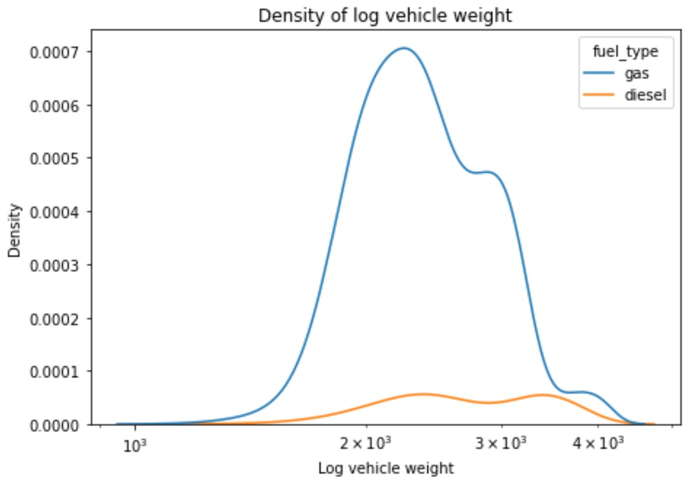
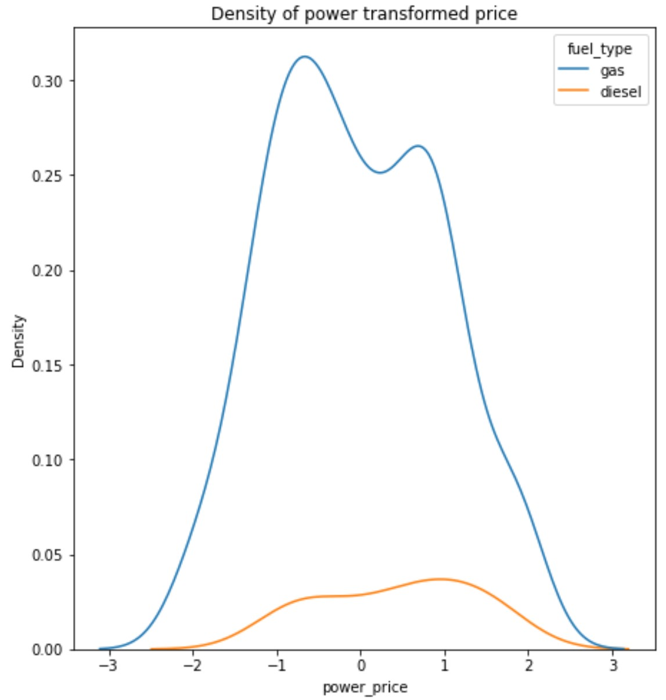

```{r setup, include=FALSE}
knitr::opts_chunk$set(echo = TRUE)
library(reticulate)
use_python("C:/Users/steph/anaconda3")
#py_install("matplotlib")
#py_install("pandas")
#py_install("numpy")
#py_install("statsmodels")
#py_install("seaborn")
#py_install("scikit-learn")
matplotlib <- import("matplotlib")
matplotlib$use("Agg", force = TRUE)
#knitr::knit_engines$set(python = reticulate::eng_python)
```

-----------------------------------------------------------------

## Why This Course?     

21st Century datasets are large and complex   


- Complexity is often harder to address than size   
- Complexity makes understanding of relationships in data difficult    
- Complexity addressed with computer-intensive methods      
- Our focus is on the big ideas of computer-intensive statistics and data analysis arising in the late 20th and early 21st Centuries   

-----------------------------------------------------------------

## Why This Course?   

**Data science** is the science of **understanding data**   

- Complexity makes understanding difficult   

- Statistics is the science of making **principled inferences** from data    
  - Inference leads to understanding     
  - Inference is becoming harder with large complex data sets  

- Doing rigorous data science requires understanding statistics     
  - Statistical practice has advanced significantly to address large complex data sets    
  - Statistical practice now dominated by computer-intensive methods


-----------------------------------------------------------------

## What We'll Cover     

Our focus is on the big ideas of computer-intensive statistics and data analysis arising in the late 20th and early 21st Centuries     

- **Exploratory data analysis (EDA)** to understand relationships in big complex data sets          
- **Foundations of algorithms** used throughout statistics and machine learning such as maximum likelihood 
- **Computer intensive resampling methods** for building models and inference, **Bootstrapping** and **MCMC Bayes**      
- **Large scale and sparse models** for complex and high-dimensional data sets   
- **Non-Normal** response models   
- **Bayesian hierarchical models** for complex relationships     
- **Modern time series and forecasting algorithms** for data with serial correlation         
- **Robust statistics** to deal with data violating model assumptions 


----------------------------------------------------------------


## Course Objectives

This fast-moving survey course helps build your toolbox for modeling complex data   

- Broad introduction to the theoretical and methodological basis of data science 
  - Conditional probability theory    
  - Sampling theory    
  - Statistical estimation theory - classical and resampling based        
  
- Understand models for complex datasets       
  - Understanding data relationships and inference             
  - How these methods work and when to used them   
  - How confident should we be in our inferences?   

- Moving beyond a cookbook or blog post approach to data science      

-----------------------------------------------------------

## Instructor: Steve Elston     

- Data science consultant with several decades of experience   

- Instructor for Harvard since 2016  

- Lead team that commercialized Bell Labs S, now open source R   

- Company co-founder and held executive positions in several industries    

- Creator of multiple edX courses, author of O'Reily books and articles     

- Holder of 5 issued patents    

- BS, physics and math (minor), University of New Mexico    

- MS and PhD, geophysics, Princeton University – NSF, John von Neuman Supercomputing Fellow   


-----------------------------------------------------------------

## Teaching Assistant: Moustafa Saleh

- A principal data scientist at Oracle Cloud    
- Received PhD in computer science from University of Texas at San Antonio     
- Worked previously at Microsoft's Advanced Threats Protection team developing ML solutions for malware detection    
- Research mainly focused on applying machine learning solutions to cyber-security challenges    


-----------------------------------------------------------------

## Teaching Assistant: Tatyana Boland

-  MBA in Finance from Texas A&M
- MLA from Harvard Extension School in Sustainability & Environmental Management  
- BA in Political Science from University of Washington
- Worked previously at Oracle OCI as Principal Technical Program Manager in Physical Networking team       


-------------------------------------------------------------

## Grading: Undergraduate

Activity | Grade weight |
|:---:|:---:|
|Participation (graded discussions) | 10% |: 8-10 online discussions
| Assignments | 90% |: 12 assignments of varing length     

- Hands-on assignments tie theory to practice applied to data examples    
  - Most of us only recall methods we actually use   
  - Lectures provide introduction only    
  - Expect to work out some details   
  - Do not hesitate to ask for help on concepts or coding!!   


-------------------------------------------------------------

## Grading: Graduate

|Activity | Grade weight |
|:---:|:---:|
|Participation (graded discussions) | 10% |: 8-10 online discussions
| Assignments | 60% |: 12 assignments of varing length     
| Independent project proposal | 5% |: Due November 18   
| Independent project report | 25% |: December 21, **no extension possible!**

- Hands-on assignments tie theory to practice applied to data examples    
  - Most of us only recall methods we actaully use   
  - Lectures provide introduction only    
  - Expect to work out some details     
  - Do not hesitate to ask for help on concepts or coding!!

- You will execute an end-to-end project on an appropriate problem of you choice     

-------------------------------------------------------------

## Grading: Graduate

Independent Graduate Project:

- An end-to-end project you will execute independently      
- Pay careful attention to grading rubric in Canvas    
- Can be great addition to your data science project portfolio   
- Pick a problem of particular interest to you!        
  - Plan to spend about 80 hours on your analysis and report    
  - Sufficient data must be available     
  - **Must use analytical methods within the scope of this course** - e.g. no advanced ML or deep learning    
- Start thinking about your project soon - don't put it off    
- Resources to help you get started are under the **Resources tab in Ed Discussion**        
  - List of possible data sources: Far from comprehensive     
  - Example project proposals and reports     


-------------------------------------------------------------

## Late Assignment Policy

- Timely feedback is an important part of the learning process     
- To allow the timely release of solutions for assignments this course applied a late assignment policy:     
  - Up to one day late - no penalty    
  - Up to 6 days late - less 20%    
  - More than 6 days late - no credit      

**Advice:** start assignments and your project as soon as you can so you have time to address problems and ask questions!   

**Note: No extension is possible for Graduate Independent Projects!**   

-------------------------------------------------------------

## Class Schedule

- Class meeting Tuesdays, 6:00 pm US Eastern Time:    
  - Focus on theory to understand concepts   
  - Limited time for code discussions   

- Section meetings **day TBD**, 6:00 pm US Eastern Time:    
  - Focus on answer student questions - your questions!    
  - Discus code and coding problems   
  - Background and supplementary material as needed    
  - Poll to find best day for class
  
- All class meetings are recorded for on-demand viewing    


---------------------------------------------------------------------

## Communications

Communicating with your instructors and other students is a significant aspect of participation in this course!     

- Ask questions about the course material, homework, etc.     
- Ask questions in the public forum so others can answer and gain from the discussion: if you have a question others do as well! 
- Answer other students' questions    
- Comment on weekly graded discussion topics       

**Ed is the primary communications method**    
  - Generally use public posts - okay to include code snippets   
  - Option to ask instructors private questions  

**Ask for the help you need!**    

Any communications by Canvas will likely be delayed  

-----------------------------------------------

## Communications

For private matters, you can directly communicate with the instructional team:        
- Grades      
- Absences      
- Etc       

Steve Elston, Instructor, stephen.elston  gmail.com    
Moustafa Saleh, TA, msaleh83  gmail.com  
Tatyana Boland, TA, tatyanaboland  gmail.com

**Office hours:** If you need individual assistance, please ask to schedule office hours. Don't be shy!   

Communications by Canvas may be **significantly delayed!**

-------------------------------------------------

## Poll    

Then, back to the lecture

-----------------------------------------------------------------

## Why Exploration and Visualization?    

**Exploratory data analysis (EDA)** tools are essential to good data science

- Isn't the goal of data science to build machine learning models?    

- Not always!    

- Often we need to understand relationships found in data     
   - Explain scientific or behavioral relationships     
   - Determine if a relationship is important     
   
- Our goal is to gain deep understanding for complex problem    
   - EDA methods   
   - Statistical inference   

----------------------------------------------------------------

## Why Exploration and Visualization?    

**Exploratory data analysis (EDA)** tools are essential to good data science

- Why not just start building machine learning models?   

- Understanding relationships in data saves missteps and unexplained poor model performance     
  - Which variables are actually important?   
  - How do these variables behave?   
  - Are there errors and outliers in the data?  
  - How good is a model fit? 

- Communications is an important component of data science     
  - Analytic results are only useful if they are understood and trusted     
  - Graphical presentation greatly assists understanding by less technical colleagues    

----------------------------------------------------------------

## Why is Perception Important?  


- **Goal:** Communicate information visually
- Visualization technique maximize the information a viewer perceives    
   - Gain insights when exploring relationships in data     
   - Communicate insights to others    
- Limits of human perception are a significant factor in understanding complex relationships
- Can apply results of the considerable research on human perceptions for data visualization


-----------------------------------------------------------

## Use Aesthetics to Improve Perception 

- Use aesthetics to improve perception
- We take a very broad view of the term 'aesthetic' here
- A plot aesthetics is any property of a visualization which highlight aspects of the data relationships
- Aesthetics are used to project additional dimensions of complex data
   - Plots generally restricted to 2-dimensional surface    
   - Must projet multiple dimensions of complex data on 2-d surface   


-----------------------------------------------------------

## Organization of Plot Aesthetics

We can organize aesthetics by their effectiveness:   

1. **Easy to perceive plot aesthetics:** help most people gain understanding of data relationships    

2. **Aesthetics with moderate perceptive power:** useful properties to project data relationships when used sparingly         

3. **Aesthetics with limited perceptive power:** useful within strict limits     


-----------------------------------------------------------

## Properties of Common Aesthetics

| Property or Aesthetic |Perception| Data Types |
|:---------|:-----------|:------------|
|Aspect ratio | Good | Numeric |
|Regression lines | Good | Numeric plus categorical |
|Marker position | Good | Numeric |
|Bar length | Good | Counts, numeric |
|Sequential color palette | Moderate | Numeric, ordered categorical |
|Marker size | Moderate | Numeric, ordered categorical |
|Line types | Limited | Categorical |
|Qualitative color palette | Limited | Categorical|
| Marker shape | Limited | Categorical |
| Area | Limited | Numeric or categorical |
| Angle | Limited | Numeric |


```{python, echo=FALSE}
#import sys
#sys.path.append('./source')
#import computationalStatisticsBook as csb
import pandas as pd
import numpy as np
import statsmodels.api as sm
from math import log, sqrt
import seaborn as sns
from math import log, sqrt, sin
import matplotlib.pyplot as plt
from sklearn.preprocessing import PowerTransformer
#%matplotlib inline

auto_price = pd.read_csv('../data//AutoPricesClean.csv')
```


-----------------------------------------------------------

## Aspect Ratio


- **Aspect ratio** has a significant influence on how a viewer perceives a chart
- Correct aspect ratio can help highlight important relationships in complex data sets    
- But, wrong aspect ratio can hide or mislead!     
- We express aspect ratio as follows:     

$$aspect\ ratio = \frac{width}{height}\ : 1$$


- **Banking angle** is key to understanding how the aspect ratio affects perception    
   - Humans are most sensitive to changes about 45 degrees    
   - Optimal banking angle controlled by aspect ratio    


-----------------------------------------------------------

## Example of Changing Aspect Ratio

Longest scientific time series is the sunspot count: 

```{python, echo=FALSE}
sunspots_data = sm.datasets.sunspots.load_pandas().data
sunspots_data.head()
```


-----------------------------------------------------------

## Example of Changing Aspect Ratio

- Example uses data from 1700 to 1980
- Can you perceive the asymmetry in these sunspot cycles? 


```{python, echo=FALSE}
fig, ax = plt.subplots(figsize=(8, 10))
fig.subplots_adjust(bottom=0.3)
ax = sns.lineplot(x='YEAR', y='SUNACTIVITY', data=sunspots_data, ci=None, ax=ax)
_=ax.set_title('Sunspot time series with 1:1 aspect ratio', fontsize=8)
_=ax.set_xlabel('Date', fontsize=8)
_=ax.set_ylabel('Sunspots', fontsize=8)
_=ax.tick_params(labelsize=8)
plt.show()
```


-----------------------------------------------------------

## Example of Changing Aspect Ratio

- Notice how changing aspect ratio change perception of the asymmetry?     

- Banking angle is near optimal   

```{python, echo=FALSE}
fig, ax = plt.subplots(figsize=(10, 1.0))
fig.subplots_adjust(top=0.75, bottom=0.4)
ax = sns.lineplot(x='YEAR', y='SUNACTIVITY', data=sunspots_data, ci=None, ax=ax)
_=ax.set_title('Sunspot time series with 1:10 aspect ratio') 
_=ax.set_xlabel('Date')
_=ax.set_ylabel('Sunspots', fontsize=8)
_=ax.tick_params(labelsize=8)
plt.show()
```

 
-----------------------------------------------------------

## Sequential and Divergent Color Palettes

Use of **color** as an aesthetic in visualization is a complicated subject. 

- color is often used, also often abused 
- A **qualitative palette** is a palette of individual colors for categorical values
- **Sequential palettes** and **divergent palettes** are a sequence of colors 
   - Numeric variables 
   - Ordered categorical variable

-------------------------------------------------------------

## Auto Weight by Sequential Color Palette


```{python, eval=FALSE}
fig, ax = plt.subplots(figsize=(8,10))
fig.subplots_adjust(top=0.8, bottom=0.2)
ax = sns.scatterplot(x='city_mpg', y='curb_weight', data=auto_price, 
                     hue = 'price', palette = 'magma', ax=ax)
_=ax.set_title('City MPG vs. Weight \nPrice by color') #, fontsize=12)
_=ax.set_xlabel('City MPG') # , fontsize=12)
_=ax.set_ylabel('Vehicle Weight') #, fontsize=12) 
plt.show()
```

-------------------------------------------------------------

## Auto Weight by Sequential Color Palette


```{python, echo=FALSE}
fig, ax = plt.subplots(figsize=(8,10))
fig.subplots_adjust(top=0.8, bottom=0.2)
ax = sns.scatterplot(x='city_mpg', y='curb_weight', data=auto_price, 
                     hue = 'price', palette = 'magma', ax=ax)
_=ax.set_title('City MPG vs. Weight \nPrice by color') #, fontsize=12)
_=ax.set_xlabel('City MPG') # , fontsize=12)
_=ax.set_ylabel('Vehicle Weight') #, fontsize=12) 
plt.show()
```


-----------------------------------------------------------

## Limits of color

Regardless of the approach there are some significant limitations

- A significant number of people are color blind. Red-green color blindness is most common 
- Even the best sequential or divergent palettes show only relative value of numeric variables
- Perception of exact numeric values is difficult, except in special cases   
- Cannot perceive large number of colors for categories   

-----------------------------------------------------------

## Marker Size

**Marker size** is moderately effective aesthetic 

- Used properly, marker size can highlight important realationships in complex data sets    
   - Numeric values    
   - Ordinal variables 
- Viewers can generally perceive relative differences, but not actual values 
- Small size differences are not preceptable  
   - Only relative relationship in numeric variables  
   - Limited steps of categorical variables   


-----------------------------------------------

## Engine Size by Marker Size and Price by Sequential Color Palette     

```{python, eval=FALSE}
fig, ax = plt.subplots(figsize=(8,7))
ax = sns.scatterplot(x='city_mpg', y='curb_weight', data=auto_price,
                     hue = 'price', palette = 'magma',
                     size = 'engine_size', sizes = (50.0, 400.0),
                     ax=ax)
_=ax.set_title('City MPG vs. Weight \nPrice by color, engine size by size') #, fontsize=18)
_=ax.set_xlabel('City MPG') #, fontsize=16)
_=ax.set_ylabel('Vehicle Weight')# , fontsize=16) 
plt.show()
```

## Engine Size by Marker Size and Price by Sequential Color Palette     

```{python, echo=FALSE}
fig, ax = plt.subplots(figsize=(8,7))
ax = sns.scatterplot(x='city_mpg', y='curb_weight', data=auto_price,
                     hue = 'price', palette = 'magma',
                     size = 'engine_size', sizes = (50.0, 400.0),
                     ax=ax)
_=ax.set_title('City MPG vs. Weight \nPrice by color, engine size by size') #, fontsize=18)
_=ax.set_xlabel('City MPG') #, fontsize=16)
_=ax.set_ylabel('Vehicle Weight')# , fontsize=16) 
plt.show()
```

-----------------------------------------------------------

## Line Plots and Line Type

**Line plots** connect discrete, ordered, data points by a line

- Can use different colors and line pattern types to differentiate categories   
- Only useful for a limited number of lines on one graph
- Too many similar colors and line patterns on one plot leads to viewer confusion and poor perception

---------------------------------------------------------------

## Limits of Line Type

```{python, echo=FALSE}
## Compute some transformed variables
sunspot_mean = sunspots_data.loc[:,'SUNACTIVITY'].mean()
y1 = [z/sunspot_mean for z in sunspots_data.loc[:,'SUNACTIVITY']]
y2 = [log(z + 0.01) for z in y1]
y3 = [1.0/(z + 0.1) for z in y1]
y4 = [sqrt(z) for z in y1]
## Construct the data frame
df = pd.DataFrame({'Date':sunspots_data.loc[:,'YEAR'],'Normalized':y1, 'Log':y2, 'Inverse':y3, 'Sqrt':y4})
## Convert the floating point year to a Pandas datetime type
df.loc[:,'Date'] = pd.to_datetime(df.loc[:,'Date'].astype(int),format='%Y')

styles = [':','-.','--','-'] # Some line styles
fig = plt.figure(figsize=(8, 5)) # define plot area
ax = fig.gca() # define axis   
temp = df[(df['Date'] > '1900-01-01') & (df['Date'] <= '1919-12-01')]
## Iterate over the time series and line styles to plot
for col, style in zip(temp[['Normalized','Log','Inverse','Sqrt']], styles):    
    _=ax.plot(temp.Date, temp[col], linestyle = style, color = 'b', label=(col+'(sunspots)'), linewidth=1)
## Annotate the plot, including legend
_=ax.set_title('Line plot of transformed sunspot data \nwith multiple line types') 
_=ax.set_xlabel('Date') # Set text for the x axis
_=ax.set_ylabel('Values')# Set text for y axis    
_=ax.legend()
plt.show()
```

-----------------------------------------------------------

## Marker Shape

**Marker shape** is useful for displaying categorical relationships

- This aesthetic is only useful when two conditions are met:
1. The number of categories is small
2. Distinctive shape are chosen for the markers
- Human perception limits the number of shapes humans can perceive well

-------------------------------------------------------

## Aspiration by Marker Shape    

```{python, echo=FALSE}
fig = plt.figure(figsize=(8,10)) # define plot area
fig.subplots_adjust(top=0.7)
ax=sns.scatterplot(x = 'city_mpg', y = 'curb_weight', 
                      style = 'aspiration', 
                      hue = 'fuel_type', 
                      data=auto_price)
_=ax.set_title('City MPG vs. Weight \nAspiration by marker shape \nFuel type by color')
_=ax.set_xlabel('City MPG')
_=ax.set_ylabel('Vehicle Weight') 
plt.show()
```


---------------------------------------------------------------------

## Regression Lines   

Regression lines draw viewers attention 

- Typically use a nonlinear regression line       
  - Polynomial    
  - Splines - piece wise model
  - Lowess - local nonlinear regression   
  
- Bootstrap confidence intervals show range of probable trends    
  - More about bootstrap resampling later   
  
- Ideally want strait line relationship  
  - Nonlinear relationships often arise from non-Normal distributions  
  - Linear relationship is more intuitive  

---------------------------------------------------------------------

## Regression Line and Tramsformation Example   

Regression lines highlight the trends for gas and diesel engines    

```{python, echo=FALSE}
g = sns.lmplot(x = 'price', y = 'curb_weight', 
                      hue = 'fuel_type',
                      order=2,
                      aspect=1.2,
                      height=5,
                      data=auto_price)
plt.title('Vehicle Weight vs. price with 2nd order regression line \nAspiration by hue \nFuel type by symbol \nEngine size by marker size', fontsize=18);
plt.xlabel('Price', fontsize=16);
plt.ylabel('Vehicle Weight', fontsize=16); 
plt.show()
```

Second order polynomial fit      

---------------------------------------------------------------------

## Regression Line and Tramsformation Example   

What are the distributions of these variables?     

```{python, echo=FALSE}
fig, ax = plt.subplots(1,2,figsize=(12, 4))
ax[0]=sns.kdeplot(x = 'price', 
                      hue = 'fuel_type',
                      data=auto_price,
                      ax=ax[0])
ax[0].set_title('Density of price');
ax[1]=sns.kdeplot(x = 'curb_weight', 
                      hue = 'fuel_type',
                      data=auto_price,
                      ax=ax[1])
ax[1].set_title('Density of vehicle weight');
plt.show()
```

Notice the right skew of these distributions    

---------------------------------------------------------------------

## Regression Line and Tramsformation Example   

Can transform distribution of variables     

- Want distribution closer to Normal   

- Many possible transformations     
  - **Logarithmic:** Often good choice for variables with values $\gt 0$      
  - **Square and square root:** Good choice for many physical systems   
  - **Power transformation:** Find best fit transformation      
  - **Fit to paramteric distribution:** Test if variable follows a known distribution     

---------------------------------------------------------------------

## Regression Line and Tramsformation Example   

Can transform distribution of variables     

- Multiple algorithms have been developed        
  - Box-Cox, the first and still widely used for values $\gt 0$    
  - Yeo-Johnson, works for values $\le 0$    
  
- The Box-Cox transform fits a value for $\lambda$ that minimizes error with respect to a Normal distribution      

\begin{split}x_i^{(\lambda)} =
\begin{cases}
\dfrac{x_i^\lambda - 1}{\lambda} & \text{if } \lambda \neq 0, \\[8pt]
\ln{(x_i)} & \text{if } \lambda = 0,
\end{cases}\end{split}

- See the [Scikit-Learn Users' Guide](https://scikit-learn.org/stable/modules/preprocessing.html#preprocessing-transformer) for more details   


---------------------------------------------------------------------

## Regression Line and Tramsformation Example   

Transform the distributions 

```{python, eval=FALSE}
pt = PowerTransformer(method='box-cox')
pt.fit(np.array(auto_price['price']).reshape(-1, 1))
auto_price['power_price'] = pt.transform(np.array(auto_price['price']).reshape(-1, 1))

fig, ax = plt.subplots(1,2,figsize=(12, 4))
ax[0]=sns.kdeplot(x = 'power_price', 
                      hue = 'fuel_type',
                      data=auto_price,
                      ax=ax[1]);
ax[0].set_title('Density of power transformed price');
ax[0].set_xlabel('Transformed price');
ax[1]=sns.kdeplot(x = 'curb_weight', 
                      hue = 'fuel_type',
                      data=auto_price,
                      ax=ax[1]);
ax[1].set(xscale="log");
ax[1].set_title('Density of log vehicle weight');
ax[1].set_xlabel('Log vehicle weight');
plt.show()
```


---------------------------------------------------------------------

## Regression Line and Tramsformation Example    

Transform the distributions 

Distribution of logarithm of the curb weight 



---------------------------------------------------------------------

## Regression Line and Tramsformation Example   

Transform the distributions 

Distribution of power transformed price, $\lambda = -0.64$ 

   

Transformed distribution has minimal skew!     


---------------------------------------------------------------------

## Regression Line and Tramsformation Example   

```{python, echo=FALSE}   
pt = PowerTransformer(method='box-cox')
pt.fit(np.array(auto_price['price']).reshape(-1, 1))
auto_price['power_price'] = pt.transform(np.array(auto_price['price']).reshape(-1, 1))


g = sns.lmplot(x = 'power_price', y = 'curb_weight', 
                      hue = 'fuel_type',
                      order=2,
                      aspect=1.2,
                      height=6,
                      data=auto_price)
plt.yscale("log");
plt.title('Log vehicle Weight vs. power transformed price with 2nd order regression line \nAspiration by hue \nFuel type by symbol \nEngine size by marker size', fontsize=18);
plt.xlabel('Power transformed price', fontsize=16);
plt.ylabel('Log vehicle Weight', fontsize=16); 
plt.show()
```

Second order polynomial fit    

-----------------------------------------------------------

## Summary

We have  explored these key points       
- Visualization is a powerful EDA method     
    - Understand relationships in data   
    - Communicate data scince insights   
    
- Proper use of plot aesthetics enable projection of multiple dimensions of complex data onto the 2-dimensional plot surface.     

- All plot aesthetics have limitations which must be understood to use them effectively     

- The effectiveness of a plot aesthetic varies with the type and the application    

- Regression lines help to focus viewer on trends        
- Transformations to linear relationships can be informative     


