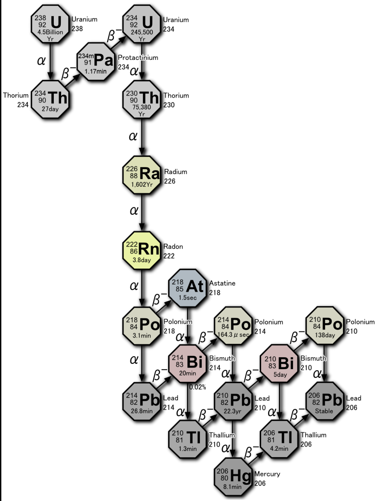
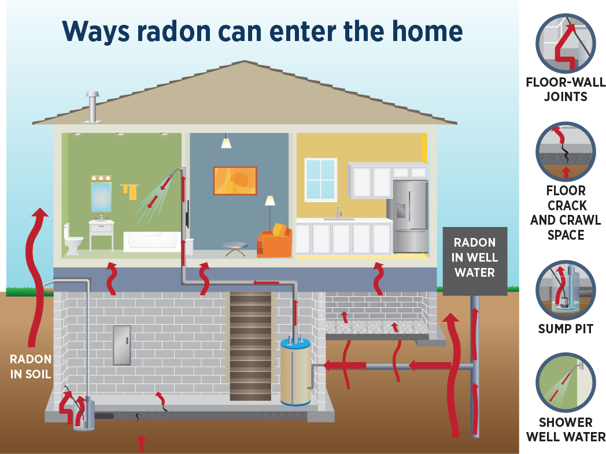
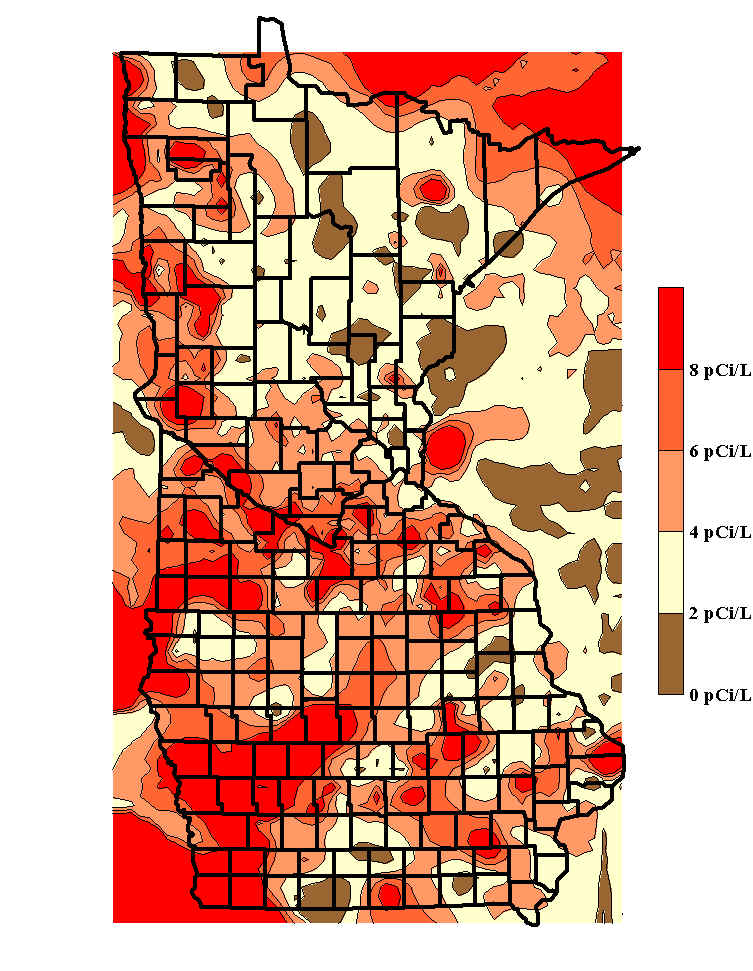

```{r setup, include=FALSE}
knitr::opts_chunk$set(echo = TRUE)
library(reticulate)
use_python("C:/Users/steph/anaconda3")
matplotlib <- import("matplotlib")
matplotlib$use("Agg", force = TRUE)
#knitr::knit_engines$set(python = reticulate::eng_python)
```


## Introduction     

Many real-world datasets have discrete categories or strata      

- Example, a chemist might measure a reaction rate at several discrete levels of pH and temperature     

- Example, demographic categories and different regions    

- Apply an hierarchical Bayes model for these situations      

## Introduction    

Key points in this lesson:     

1.	Pooled vs. unpooled models    

2.	Defining hierarchical models through hyperpriors and priors    

3.	Evaluation and comparison of Bayesian models      


## Pooled vs. Unpooled Models

Pooled model computes model coefficients that give the best fit to the overall dataset 

- Pooled model has a flat structure   

- Model coefficients are at the same level     

- Pooling maximizes statistical power using all available data to fit a model    

- Pooling limits flexibility if strata have different behavior  


## Pooled vs. Unpooled Models

Unpooled models are the opposite of pooled models         

- For each category a separate and independent model is fit   

- Approach maximizes flexibility   

- Variance of each of the, many, models ise large   

- Unpooled models has a flat structure     


## Overview of Hierarchical Models   

Hierarchical models find the best of both worlds     

- Hierarchical approach is between the extremes of pooled and unpooled models   

- Hierarchical models constructed as a hierarchy of hyperpriors     

- The Hyperpriors represent the prior information on the pooled data    

- Hyperpriors act as priors for each specific case


## Example: Dangers of Radon in Homes    

The unstable isotope Radon-222 is an invisible and order-less gas    

$Rn_{222}$ is the product of a nuclear decay chain of Uranium 238      



<center> Decay chain of Uranium-238 to Radon-222 <center> 
<center> Credit: <a href="https://en.wikipedia.org/wiki/Radon-222">Wilipedia Radon-222 article!</a> <center>
 
 
## Example: Dangers of Radon in Homes   

Depending on rock and soil type, trace amounts of Uranium-238 are present      

- Uranium is [effectively transported by ground water](https://www.nrc.gov/docs/ML0931/ML093160829.pdf)     

- Decay products, including $Rn_{222}$, are dispersed in the environment    
    
- Health risk of Radon infiltration into homes is [well-documented](https://www.epa.gov/radon/health-risk-radon)      

- $Rn_{222}$ is the most prevalent cause of lung cancer amount US nonsmokers    

- Outdoors, $Rn_{222}$ does not accumulate in dangerous quantity     

## Example: Dangers of Radon in Homes   

Depending on rock and soil type, trace amounts of Uranium-238 are present     

- In poorly ventilated buildings, Radon gas accumulates to dangerous levels    

- $Rn_{222}$ molecule is heavy, and accumulates in low areas, such as basements   

- Connections to wells or contact with ground water accumulate more dangerous levels of Radon       


<center> Common ways Radon-222 enters homes <center> 
<center> Credit: <a href="https://matracking.ehs.state.ma.us/Environmental-Data/radon/radon_lessons.html">Massachusetts Department of Public Health!</a> <center>


## Example: Dangers of Radon in Homes   

Randon concentration changes with soil and rock composition and ground water chemistry   

- $Rn_{222}$ risk changes significantly with geographic location     

- Risk varies considerably in space      


<center> Map of Radon in homes for counties in IA and MN <center> 
<center> Credit: <a href="http://employees.csbsju.edu/dsteck/mnradon/">Minnesota Radon Project!</a> <center>


## Bayesian Modeling of Radon Concentration      

For this example we construct and compare three models:    

1. A pooled model with a single intercept and slope for all counties    

2. An unpooled model with separate intercepts and slopes for each county   

3. An hierarchical model with hyperpriors for all counties    
    - Next level are slopes and intercepts for each county computed using the hyperpriors.   

## Radon Dataset    

```{Python, echo=False}
import arviz as az
import matplotlib.pyplot as plt
import seaborn as sns
import numpy as np
import pandas as pd
import pymc3 as pm
import theano
import xarray as xr
import scipy.stats as spst
import warnings 

warnings.filterwarnings('ignore')
%config InlineBackend.figure_format = 'retina'
%matplotlib inline
az.style.use("arviz-darkgrid")
```

